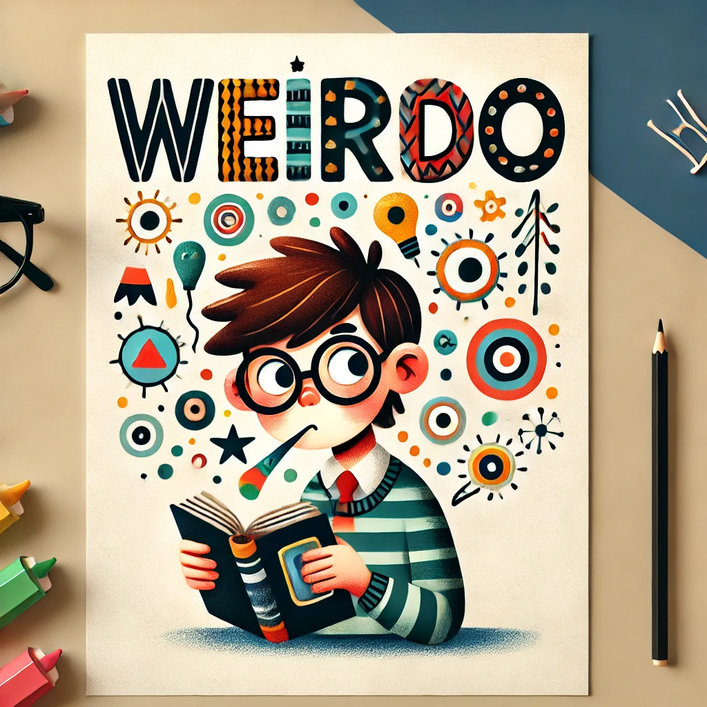

<!-- I wanted to maintain the flow of my paragraphs so I updated the .markdownlint.yaml config file to allow a line length extension to 300-->
<!-- couldn't center using markdown so I modified the .markdownlint.yaml config to allow in-line html-->

  

# 🎖️ Hey, I'm Weirdo - The Code-Obsessed Oddity 🎖️  

<!-- couldn't center using markdown so I modified the .markdownlint.yaml config to allow in-line html-->

  
  
  

**Yep!, my name is Weirdo 🤪**, and I'm here too prove that being a little
_weird_ is actually pretty awesome 🚀. I am a robotics 🤖 geeks, I like write ✍️ a lot during my leisure time, and I have been known to have deep philosophical conversations with my computer when it refuses to cooperate 💻🤯. I am all about embracing the weirdness and making it work.

<!-- h2 header would be too big for me that's why I opted for 5#s -->
##### Here are a few things that make me weirdly awesome

+ I talk to my code like it can hear me 🥶💻
+ I drink way too much coffee and still find myself falling asleep during meetings ☕😴
+ I have an unhealthy obsession with collecting stickers, and yes, they’re all over my laptop 💻🎨
+ I code at weird hours, because inspiration strikes at 3 AM 🌙💡
+ I have a collection of weird error messages 🧐 – Don’t ask how, don’t ask why. It just happens.
+ Projects: Too weird to explain, but awesome!  🤖

Let’s embrace the weirdness together, shall we? 🤪

## TECH STACK

From Python spells to Kubernetes chaos, I wield tools like a mad scientist on a caffein high - building, breaking, and bending tech at my will 🪄. Meet my pals ⤴️:
<!-- Decided to add a few badges -->
<!-- Modified my .markdownlint.yaml config file so I can add in-line html to control the sizes of some of my stat and widgets-->

  
  
  
  
  
  
  
  

## Let's connect

Not much of the media type, but you can find me here: [Linkdln](extras/in/jeffery-offei-darko-8440222b3)

  
<!-- Modified my .markdownlint.yaml config file so I can add in-line html to control the sizes of some of my stat and widgets-->
Let's code, connect, and create awesome things together  
Feel free to browse my projects and maybe leave a ⭐ if you like what you see!

<table style="border: 3px solid black; border-collapse: collapse;">
  <tr>
    <td style="border: 3px solid black;">
      
    </td>
    <td style="border: 3px solid black;">
      
    </td>
  </tr>
</table>

